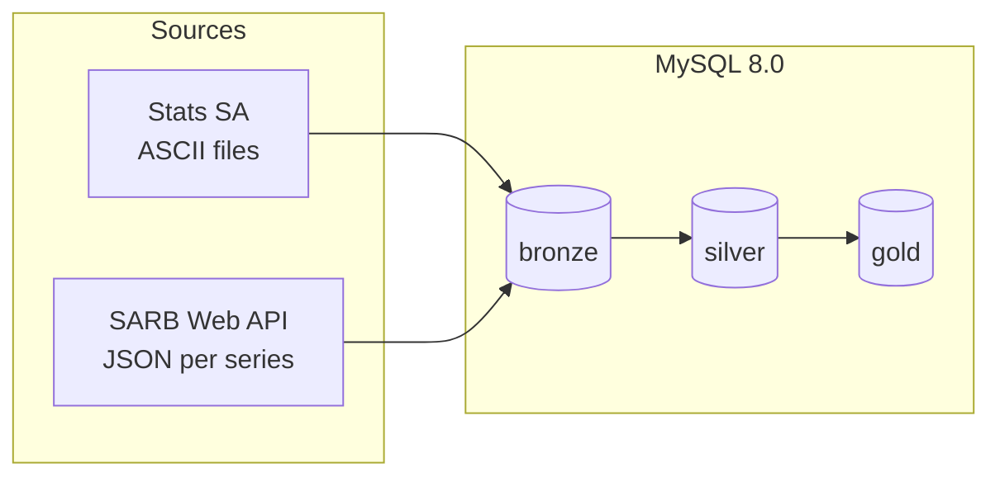

# South African Economic Data Warehouse

A MySQL data warehouse built on the bronze/silver/gold (medallion)
architecture, using two real South African publishers: **Stats SA** (retail
trade sales and consumer prices) and the **SARB** (interest and exchange
rates). Built for the data engineering elective at WeThinkCode_.

This project started from and follows the structure of
[baraaKhatib/sql-data-warehouse-project](https://github.com/DataWithBaraa/sql-data-warehouse-project)
(MIT licensed) — see [Attribution](#attribution). The source systems, data,
and SQL dialect (MySQL, not SQL Server) are entirely different; the layered
approach and repo layout are what carry over.

---

## Data architecture

Bronze, silver, and gold are three separate MySQL databases (a MySQL schema
*is* a database, so this is the direct equivalent of the original repo's
three SQL Server schemas).



See [`docs/diagrams.md`](docs/diagrams.md) for the full architecture, ETL
flow, and star-schema diagrams, and [`docs/data_catalog.md`](docs/data_catalog.md)
for every gold column.

1. **Bronze** — raw data, as downloaded, with every column as text. Loaded
   with `LOAD DATA (LOCAL) INFILE` from CSVs (Stats SA's ASCII files and
   SARB's JSON are both flattened to CSV first — see
   [`docs/DATASOURCES.md`](docs/DATASOURCES.md)).
2. **Silver** — cleansed, typed, and standardised. Loaded by the
   `silver_layer.load_silver()` stored procedure.
3. **Gold** — a business-ready star schema, built as views over silver: two
   Stats SA fact tables (`fact_retail_sales`, `fact_cpi_headline`) and one
   SARB fact table (`fact_monthly_rates`), sharing one `dim_date`.

## Data sources

| Publisher | Data | Real or sample |
|---|---|---|
| Stats SA | Retail trade sales (P6242.1), monthly, Jan 2002– | Real, downloaded |
| Stats SA | Consumer Price Index by COICOP (P0141), monthly, Jan 2008– | Real, downloaded |
| SARB | Repo/policy rate, prime lending rate, Rand per US Dollar | Real, downloaded daily series |

Full download links, file layouts, and known data characteristics are in
[`docs/DATASOURCES.md`](docs/DATASOURCES.md).

## Project requirements

See [`docs/requirements.md`](docs/requirements.md). In short: cleanse and
integrate two independent South African publishers into one analytics-ready
model, using only real, current data — no synthetic or CRM/ERP sample data.
Historisation and incremental loading are explicitly out of scope.

## Tools

Everything used here is free:

- **[MySQL Community Server 8.0+](https://dev.mysql.com/downloads/mysql/)** — the database (window functions and recursive CTEs, both used in gold, need 8.0+)
- **[MySQL Workbench](https://dev.mysql.com/downloads/workbench/)** — for running and testing every `.sql` script
- **[Python 3.8+](https://www.python.org/)** — for the ingestion scripts in `ingestion/` (standard library only, nothing to install)
- **[VS Code](https://code.visualstudio.com/)** + its built-in git panel — for version control
- **[Mermaid](https://mermaid.js.org/)** — diagrams, rendered inline in `docs/diagrams.md` on GitHub
- A GitHub repository for version control

See [`docs/tsql_to_mysql.md`](docs/tsql_to_mysql.md) for the T-SQL syntax
this project's structure was adapted from, and the MySQL equivalents used
instead.

## Repository structure

```
├── datasets/
│   ├── ASCII_RTS.txt, ASCII_CPI.txt      Stats SA raw ASCII downloads
│   ├── RTS.xlsx, CPI.xlsx                Stats SA Excel (used only to verify silver)
│   ├── MMRD002A.json, MMRD000A.json,     SARB raw JSON downloads
│   │   EXCX135D.json
│   ├── source_statssa/                   statssa_series.csv, statssa_values.csv (generated)
│   └── source_sarb/                      sarb_series.csv, sarb_observations.csv (generated)
├── docs/
│   ├── requirements.md        Project scope
│   ├── DATASOURCES.md         Where the data comes from, and its quirks
│   ├── data_catalog.md        Gold layer, column by column
│   ├── diagrams.md            Architecture, ETL flow, star schema (Mermaid)
│   ├── SETUP_AND_RUN.md       Run order, expected row counts, sample queries
│   ├── tsql_to_mysql.md       Porting notes from the original T-SQL repo
│   ├── known_issues.md        Issues found and how they were handled
│   ├── project_breakdown.md   Phases, checklist, schedule
│   └── commit_plan.md         Suggested incremental commit history
├── ingestion/
│   ├── statssa_to_csv.py      Flattens the Stats SA ASCII files
│   ├── sarb_to_csv.py         Flattens the saved SARB JSON files
│   └── download_sarb.py       Downloads SARB series
├── scripts/
│   ├── init_database.sql      Creates the bronze_layer/silver_layer/gold_layer databases
│   ├── bronze/                DDL + load_bronze.sql
│   ├── silver/                DDL + load_silver.sql (the load_silver() procedure)
│   └── gold/                  Star schema views
├── test/
│   ├── quality_checls_silver.sql   15 checks (filename typo — see docs/known_issues.md #4)
│   └── quality_checks_gold.sql     5 checks
├── LICENSE
└── README.md
```

## Getting started

1. Read [`docs/DATASOURCES.md`](docs/DATASOURCES.md) and download the
   Stats SA and SARB files into `datasets/`.
2. Follow [`docs/SETUP_AND_RUN.md`](docs/SETUP_AND_RUN.md) — it has the exact
   run order, the row counts to expect at each layer, and what the quality
   checks should (and shouldn't) return.
3. Try the sample queries at the end of that same file.

## Data quality

15 silver checks and 5 gold checks live in `test/`. All were run against
real MySQL 8.0 with the actual downloaded data, and negative-tested by
deliberately breaking rows to confirm each check catches the problem it's
meant to. Findings are documented in `docs/data_catalog.md` and
`docs/DATASOURCES.md` rather than hidden — for example, two CPI series that
stop publishing early, and Stats SA's retailer-type totals reconciling only
within a small rounding margin.

## Out of scope

- Customer or transaction-level data
- Incremental loading and history tracking (SCD)
- Anything not in this repository or in the two named publishers

---

## Attribution

- **Structure and approach** adapted from
  [DataWithBaraa/sql-data-warehouse-project](https://github.com/DataWithBaraa/sql-data-warehouse-project)
  (MIT License, © 2024 Baraa Khatib Salkini). See [`LICENSE`](LICENSE).
- **Data**: Statistics South Africa (Stats SA) — retail trade sales (P6242.1)
  and Consumer Price Index (P0141). Reproduced and processed under Stats SA's
  data policy; this is independent analysis of Stats SA data, not an
  official Stats SA product.
- **Data**: South African Reserve Bank (SARB) Web API — repo/policy rate,
  prime lending rate, and exchange rate data.

## License

MIT — see [`LICENSE`](LICENSE).