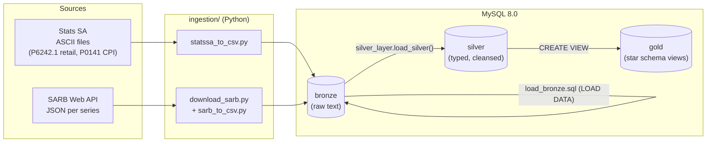
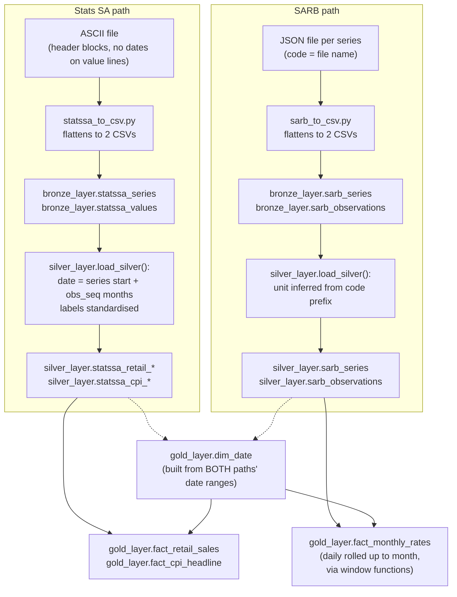
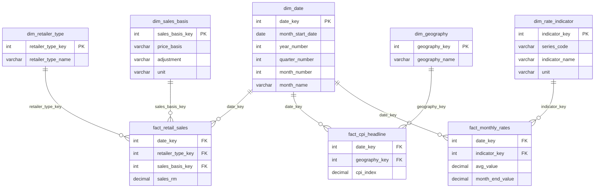

# Diagrams

Mermaid diagrams, replacing the original repo's PNG/PDF exports
(`data_architecture.png`, `data_flow.png`, `data_model.png`, `data_layers.pdf`,
`ETL.png`). These render directly on GitHub and in most Markdown viewers — no
separate image files to keep in sync with the SQL.

---

## 1. Data architecture

How the two source publishers reach the three MySQL databases (bronze,
silver, gold) that stand in for the medallion layers.

**Notes:**
- Bronze keeps everything as text and is truncate-and-load — a re-run never
  duplicates data.
- Silver is a stored procedure (`silver_layer.load_silver()`) with an exit handler
  that `RESIGNAL`s on error, so a failed load is never mistaken for a
  finished one.
- Gold is views, not tables — it always reflects the current silver data
  with no separate load step.

---

## 2. Data flow (ETL detail)

What happens to a value on its way from a downloaded file to a gold fact row.
Two parallel paths — Stats SA and SARB — that only meet in gold, through the
shared `dim_date`.

---

## 3. Data model (star schema)

The gold layer as an entity-relationship diagram. Two fact tables share
`dim_date`; `fact_retail_sales` and `fact_cpi_headline` are Stats SA-only,
`fact_monthly_rates` is SARB-only.

See `docs/data_catalog.md` for column-level detail on every object above.